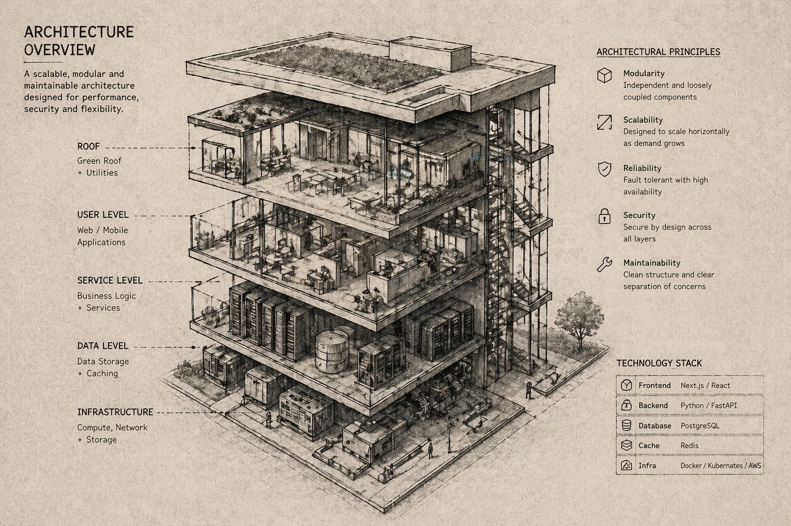

# ame-skill



> Agent skills for VS Code, Google Antigravity, and Claude Code that turn a vague idea into a confirmed spec and a chunked, executable implementation plan — in as few as **3 exchanges**.

```
/ame  →  single compiled interview  →  .ame/spec.md
/ema  →  layer-based plan           →  .ame/plan.md  →  chunk-by-chunk execution
```

[](LICENSE)


---

## Why

The biggest source of rework in software is starting to code before the requirements are actually understood — by the developer or the AI. These two skills enforce a **spec-before-code** discipline without slowing you down.

`/ame` closes the knowledge gap in one compiled interview message — all relevant questions at once, answered once, written to spec once. No 6-round back-and-forth.

`/ema` reads that spec, identifies which architectural layers the project spans, generates a dependency-ordered plan, and asks for confirmation before touching anything.

---

## Prerequisites

- An AI coding IDE that supports **agent/agentic mode** with file-write capability (see Install section)
- Optional: [context7 MCP server](https://github.com/upstash/context7) for live library documentation during the interview

---

## Install

The skills use the [open agent skills standard](https://agentskills.io/home) — a `SKILL.md` file in a named folder. The same files work across VS Code, Antigravity, and any other IDE that supports the standard. Claude Code uses a different installation method documented below.

### VS Code (GitHub Copilot)

Copy the skill files to your VS Code agent skills folder:

**Windows:**
```
%USERPROFILE%\.agents\skills\ame\SKILL.md   ← from skills/ame/SKILL.md
%USERPROFILE%\.agents\skills\ema\SKILL.md   ← from skills/ema/SKILL.md
```

**macOS / Linux:**
```
~/.agents/skills/ame/SKILL.md
~/.agents/skills/ema/SKILL.md
```

Then restart VS Code. Both skills require **Agent mode** — Ask mode cannot write files.

### Google Antigravity

Copy the skill files to Antigravity's global skills folder:

**Windows:**
```
%USERPROFILE%\.gemini\antigravity\skills\ame\SKILL.md
%USERPROFILE%\.gemini\antigravity\skills\ema\SKILL.md
```

**macOS / Linux:**
```
~/.gemini/antigravity/skills/ame/SKILL.md
~/.gemini/antigravity/skills/ema/SKILL.md
```

Antigravity's agent is always in agentic mode — no extra configuration required. Skills are auto-discovered and invoked by description matching.

### Claude Code

Claude Code uses a custom slash commands directory instead of the skills standard.

**Global (all projects):**
```
~/.claude/commands/ame.md   ← copy contents of skills/ame/SKILL.md
~/.claude/commands/ema.md   ← copy contents of skills/ema/SKILL.md
```

**Project-level only:**
```
.claude/commands/ame.md
.claude/commands/ema.md
```

After copying, `/ame` and `/ema` will appear as slash commands in Claude Code. Claude Code runs in agentic mode by default, so file writing works without extra configuration.

### Via skills CLI (VS Code and Antigravity)

```bash
npx skills add github:CSKishan/ame-skill
```

### Workspace-level install (any supported IDE)

You can also install skills at the project level — useful for team repos where everyone should have access:

```
<project-root>/.agents/skills/ame/SKILL.md
<project-root>/.agents/skills/ema/SKILL.md
```

---

## Quick Start

```
# VS Code (Agent mode) / Google Antigravity / Claude Code:

/ame I want to build a patient medication tracker for a hospital tablet app

# Answer the interview. AME writes .ame/spec.md.
# When done:

/ema

# EMA reads the spec, writes .ame/plan.md, and shows a chunk summary.
# Reply "yes" to execute chunk by chunk, or "run all" to execute everything at once.
```

> All three IDEs support agentic file writing, so both skills work identically regardless of which IDE you use.

---

## How Many Requests Does This Use?

### /ame

| Scope | Requests |
|-------|---------|
| `micro` (single file / script) | 2 — questions, then confirm |
| `small` (<5 files, no auth/compliance) | 2–3 — questions, answer, confirm |
| `full` (auth, integrations, compliance) | 2–3 — questions, answer, confirm |

The old sequential model used **7+ requests for full scope**. The batch interview model compresses this to **2–3 regardless of scope**.

### /ema

| Action | Requests |
|--------|---------|
| Generate plan | 1 |
| Execute each chunk (with per-chunk confirmation) | 1 per chunk |
| Execute all chunks ("run all") | 1 for all + 1 final summary |

---

## Scope Levels

AME automatically estimates scope from your opening description:

| Signal | Scope | Dimensions asked |
|--------|-------|-----------------|
| Single file, script, formatter, quick fix | `micro` | Edge cases only (3 questions) |
| <5 files, no external systems, no auth | `small` | Tech stack + Features + Edge cases |
| Multiple systems, auth, integrations, compliance, or unknown | `full` | All 5 dimensions |

You can correct the scope estimate before answering.

---

## The Interview Dimensions ([A]–[E])

| Dimension | Covers |
|-----------|--------|
| **[A] Tech Stack** | Language, runtime, framework, platform, team |
| **[B] Features & Architecture** | Core features, actors, data flow, patterns |
| **[C] Security & Compliance** | Auth, data sensitivity, regulations, trust boundaries _(full scope only)_ |
| **[D] Quality & Operations** | Accessibility, performance, testing, CI/CD _(full scope only)_ |
| **[E] Edge Cases & Gaps** | Failure modes, degraded state, assumptions, open questions |

---

## Layer Model (EMA)

EMA chunks the work by architectural layer dependency:

| Layer | Standard | Embedded / Firmware | Data Pipeline |
|-------|----------|---------------------|---------------|
| 0 — Foundation | Models, auth, config | BSP, HAL, MCU init | Source connectors, schema |
| 1 — Core Logic | Business logic, APIs, services | RTOS tasks, drivers, protocols | Transform, enrichment, validation |
| 2 — Delivery / IO | UI, integrations, wiring | Application, host comms | Sinks, serving layer |

Layer 2 is **absent** for headless backends, pure CLI tools, standalone firmware, and data pipelines where sinks are core logic.

---

## The Spec File — `.ame/spec.md`

AME writes and maintains this file. It lives in your project root and is the contract between AME and EMA.

**Commit it.** It documents every decision made before coding began — invaluable for onboarding, audits, and revisiting requirements.

A blank template lives at `.ame/spec-template.md`.

---

## The Plan File — `.ame/plan.md`

EMA writes this file. It contains:

- Plan risks (LOW-confidence spec dimensions)
- Project summary and stack
- Per-chunk breakdown: files, implementation steps, security/accessibility checklists, validation gate, rollback instructions
- Post-execution checklist

**Commit this alongside your code** for traceability.

---

## Shortcuts

| Trigger | Behaviour |
|---------|-----------|
| `/ame` with a description | Starts interview immediately from your description |
| `/ame` without a description | AME asks for a one-sentence intent |
| "done" / "plan it" / "proceed" during `/ame` | Finalises spec and shows handoff message |
| `/ema` during `/ame` | AME finalises spec, EMA takes over immediately |
| "review" during `/ema` | Shows full `.ame/plan.md` before execution |
| "run all" during `/ema` | Executes all chunks back-to-back; pauses only on validation failure or when a gate item requires manual confirmation |
| "adjust {description}" during `/ema` | Updates plan before executing |

---

## Context7 Integration

AME uses the [context7 MCP server](https://github.com/upstash/context7) to fetch live library documentation when you name a specific framework in your opening description. Context7 works wherever MCP is supported — VS Code, Antigravity, and Claude Code all support MCP servers.

- Fires **once**, before the interview questions are compiled
- Capped at **3 call-pairs per session**
- If context7 is unavailable, AME logs it and continues — the interview is never blocked

**VS Code** — add to your VS Code MCP configuration:

```json
"context7": {
  "command": "npx",
  "args": ["-y", "@upstash/context7-mcp@latest"],
  "type": "stdio"
}
```

**Antigravity** — add to `~/.gemini/antigravity/mcp_servers.json` (or via Antigravity's MCP settings panel).

**Claude Code** — add to `~/.claude/claude_desktop_config.json` under `mcpServers`:

```json
"context7": {
  "command": "npx",
  "args": ["-y", "@upstash/context7-mcp@latest"]
}
```

---

## Supported IDEs

| IDE | Install method | Agent / file-write mode |
|-----|---------------|-------------------------|
| VS Code (GitHub Copilot) | `~/.agents/skills/` global or `.agents/skills/` per-project | Agent mode (must be enabled) |
| Google Antigravity | `~/.gemini/antigravity/skills/` global or `.agents/skills/` per-project | Always agentic |
| Claude Code | `~/.claude/commands/` global or `.claude/commands/` per-project | Always agentic |

Any IDE that supports the [open agent skills standard](https://agentskills.io/home) and can write files to the workspace will work.

---

## Domains

Built to work across:

- Web and mobile applications (React, Vue, Flutter, React Native, etc.)
- Backend services and REST / GraphQL APIs
- Embedded firmware and RTOS-based systems (STM32, ESP32, FreeRTOS, Zephyr)
- Data pipelines and ETL systems
- CLI tools and developer utilities
- Industrial, medical, and safety-critical software

---

## FAQ

### Can I use /ema without running /ame first?

Yes, but EMA will flag the missing spec as a plan risk and note that accuracy is low. For best results, always run `/ame` first.

### What if I don't want to answer all the questions?

Skip any that don't apply. AME marks unanswered fields as `[NOT PROVIDED]` and flags them as assumptions. You can correct anything significant in the Section [6] confirmation step.

### Can I edit `.ame/spec.md` manually?

Yes. EMA reads whatever is there. Preserve the section headers ([A]–[E]) so EMA can parse them correctly.

### What if the scope estimate is wrong?

Correct it before answering the interview. AME accepts any correction and recompiles the right set of questions.

### Does this work offline (without context7)?

Fully. Context7 is optional. AME logs when it's unavailable and continues the interview without it.

---

## Contributing

Pull requests are welcome. Please keep skill changes backward-compatible with the `.ame/spec-template.md` format — EMA's parser depends on consistent section headers ([A]–[E] and [6]).

When changing the spec format:
1. Update `spec-template.md`
2. Update AME's Step 2 spec write template
3. Update EMA's Step 1 spec read references

---

## Licence

MIT
